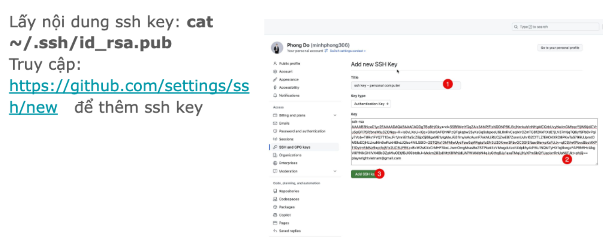
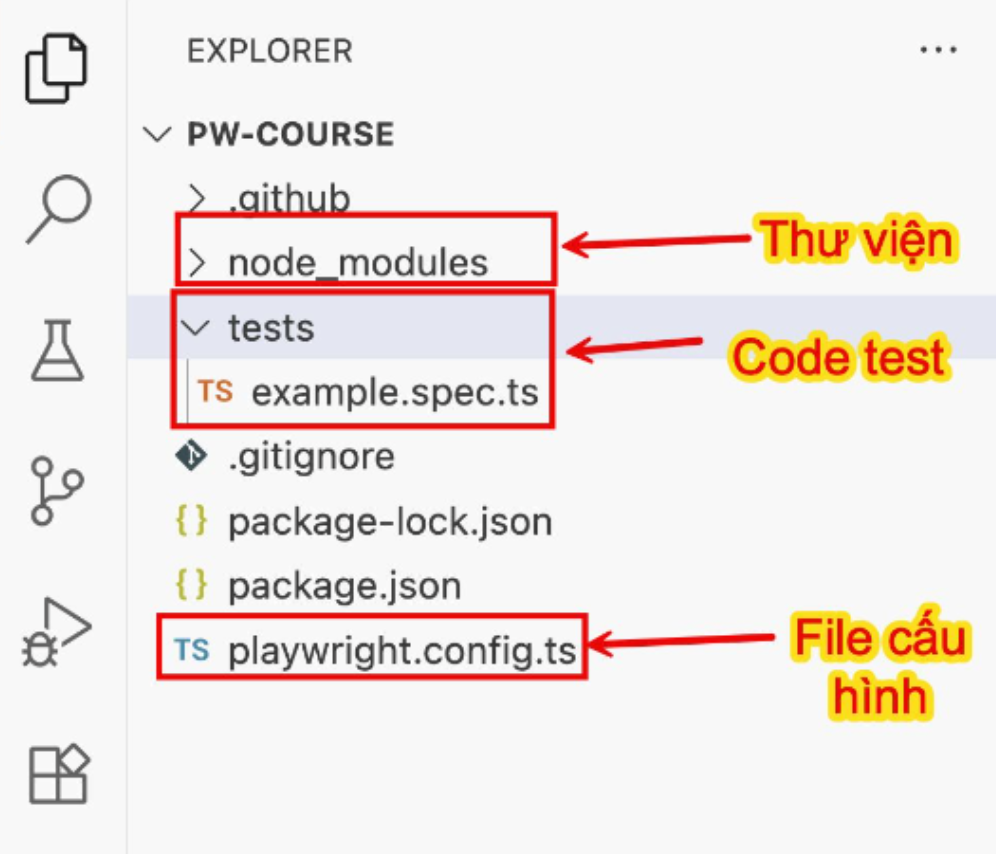

# Lộ trình
Khởi động : Cài đặt máy (buổi 1)
Chậm mà chắc : Kiến thức nền tảng (buổi 1 -> 4)
Vượt chướng ngại vật : Kiến thức automation (buổi 5 -> 9)
Tăng tốc : Tối ưu code (buổi 10 -> 13)
Về đích : Setup project, CI CD (buổi 14, 15)

# Cài đặt
NVM = Node Version Manager - quản lý các phiên bản NodeJS
NodeJS - công cụ để chạy code
Git - quản lý source code
Github - chia sê code, làm việc nhóm
VS Code = IDE = integrated development environment - là công cụ để viết code

### Cấu hình Git
Cấu hình mặc định:
- Config username: ```git config --global user.name "<name>"```
- Config email: ```git config --global user.email "<email>"```
- Config branch default: ```git config --global init.defaultBranch main```

### SSH key
Local computer : Git - SSH key: private key **id_rsa** cần giữ bí mật
Online : GitHub - SSH key: public key **id_rsa.pub** có thể gửi cho người khác
SSH key cặp khoá 2 cái: 
- giúp xác thực đăng nhập dễ dàng hơn
- lưu ở ~/.ssh
- ~ đại diện cho thư mục Home
- Home ở Mac: /Users/Moon
- Lệnh tạo SSH Key: ```ssh-keygen -t rsa -b 4096 -C "your_email@gamil.com"```
- Khi tạo, mật khẩu của key nên bỏ trống. Nếu có key rồi thì stop
- Lấy nội dung ssh key: ```cat ~/.ssh/id_rsa.pub```


# Playwright
là một framework, tiền thân là Puppeteer được Microsoft tài trợ và phát triển
**Ưu điểm**
- Cross browser
- Cross platform
Auto waiting, auto-retry assertion giúp giảm flaky tests (lúc pass, lúc fail)
- Report đầy đủ thông tin
- Code gen

# Cài đặt, chạy Playwright đầu tiên
- tạo thư mục ở máy mình
- Mở VS Code, mở terminal
- Chạy lệnh: ```npm init playwright@latest```
- Enter đến khi xong
- Cấu tạo


# Đưa code lên GitHub
- Khởi tạo repo local: ```git init``` (duy nhất 1 lần)
- Tạo repo GitHub và lấy url, liên kết tới repo local: ```git remote add origin <url>``` (duy nhất 1 lần)
- Thêm file vào staging: ```git add .```
- Commit file: ```git commit -m "<message>"```
- Push code: ```git push origin main```