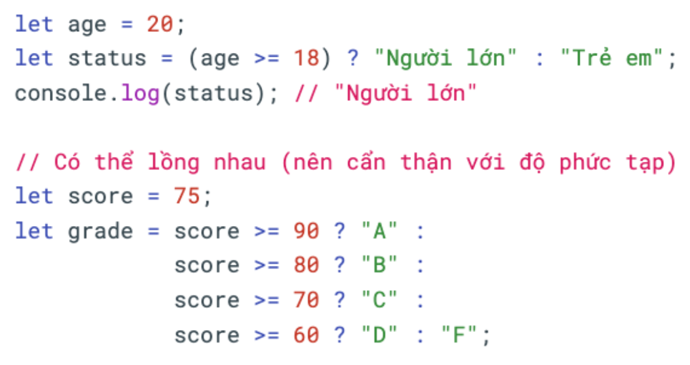
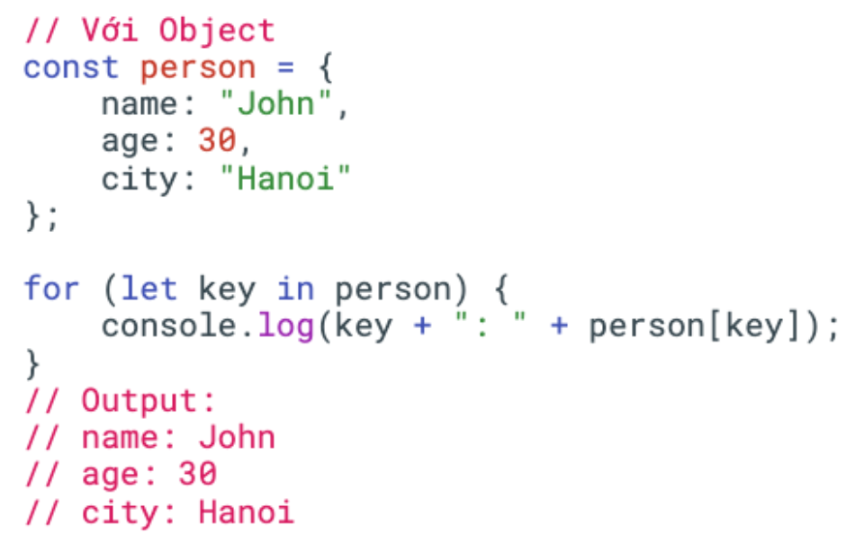
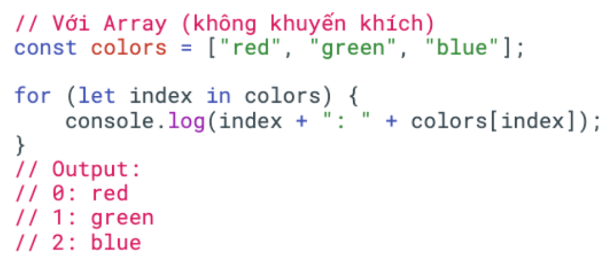
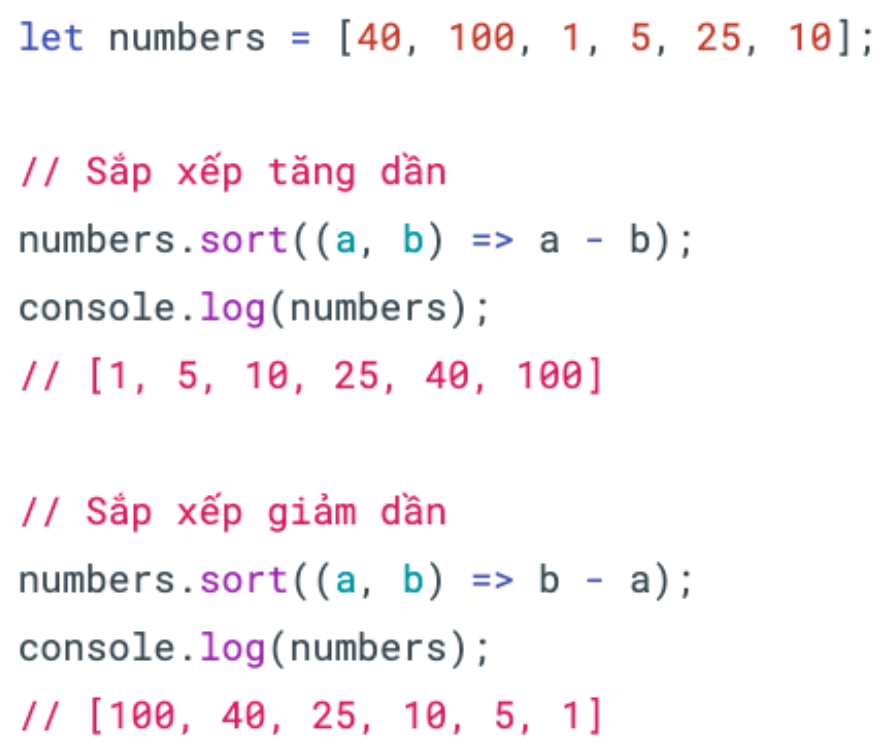

# I. Phạm vi của biến
## **3 scopes**
### 1. Block scope (khối)
Biến được khai báo trong cặp ngoặc nhọn
- var: không bị limit bởi cặp ngoặc nhọn
- let/const: bị limit bởi cặp ngoặc nhọn. Ra ngoài bị undefined

### 2. Function scope (hàm)
Biến được khai báo trong hàm
Cả var/let/const ra ngoài hàm đều bị undefined

### 3. Global (toàn cục)
Biến được khai báo ở một dòng code tự do, không nằm trong khối hay hàm

# II. break
break dùng để thoát hoàn toàn khỏi vòng lặp ngay lập tức

# III. continue
continue dùng để bỏ qua phần còn lại của vòng lặp hiện tại và chuyển sang lần lặp tiếp theo

# IV. Câu điều kiện nâng cao
**if...else** thực thi code khác nhau cho trường hợp true và false
```TS
if (condition) {
    code...
} else {
    code...
}
```
**if...else if** kiểm tra nhiều điều kiện theo thứ tự
```TS
if (condition) {
    code...
} else if (condition) {
    code...
} else if (condition) {
    code...
} else {
    code...
}
```
**Ternary operator** (toán tử điều kiện): cách viết ngắn gọc cho if...else đơn giản


# V. Vòng lặp nâng cao
**for...in** dùng để duyệt qua các thuộc tính (properties) của 1 object



**forEach** method của array để thực thi 1 function cho mỗi phần tử. Không thể dùng break hay continue
```TS
const numbers = [1,2,3,4];
numbers.forEach(function(i){
    let a = i + 3
    console.log(a);
});
```

# VI. Utils functions
Utils = tiện ích
Utils functions là các hàm có sẵn của JavaScript, giúp việc code trở nên nhanh gọn hơn
## 1. String utils - các hàm xử lý chuỗi
**Bỏ khoảng trắng**
- trim(): bỏ khoảng trắng 2 đầu
- trimStart(): bỏ khoảng trắng bên trái
- trimEnd(): bỏ khoảng trắng bên phải

**Chuyển đổi HOA -> thường**
- Chữ thường -> chữ HOA: toUpperCase
- Chữ HOA -> chữ thường: toLowerCase

**Kiểm tra chuỗi có bao gồm chuỗi con không**
Dùng hàm **includes**
```TS
let text = "Hello World";
console.log(text.includes("World")); //true
console.log(text.includes("world")); //false
```

**Cắt chuỗi**
Dùng hàm **split**
```TS
let text = "Hello Worlds JS";
console.log(text.split(" ")); // ["Hello", "Worlds", "JS"]
```

**Thay thế chuỗi con bằng chuỗi con khác**
Dùng hàm replace
```TS
let text = "Hello World";
console.log(text.replace("World", "Moon")); // Hello Moon
```

#### Reference
https://developer.mozilla.org/en-US/docs/Web/JavaScript/Reference/Global_Objects/String

## 2. Array utils - các hàm xử lý mảng
**Thêm phần tử vào mảng**
- Thêm vào cuối
push(<phần tử>)
- Thêm vào đầu
unshift(<phần tử>)
- Thêm vào giữa
splice(<vị trí>,<số phần tử cần xoá>,<phần tử cần thêm vào>)
```TS
let arr = [0,1,2,3];
arr.splice(2, 0, 1.5);
console.log(arr); // [0, 1, 1.5, 2, 3]
```

**Xoá phần tử khỏi mảng**
- Xoá ở cuối: pop()
- Xoá ở đầu: shift()
- Xoá ở vị trí bất kỳ: splice(<vị trí>,<số phần tử cần xoá>)

**Tìm kiếm phần tử**
- Trả về phần tử đầu tiên hợp lệ: find()
- Trả về tất cả các phần tử hợp lệ: filter()

**Biến đổi mảng**
map() - tạo mảng mới bằng cách áp dụng 1 hàm lên từng phần tử của mảng gốc. Trả về mảng mới có cùng độ dài
```TS
let numbers = [1,2,3,4];
let doubled = numbers.map(num => num * 2);
console.log(doubled); // [2,4,6,8]
```

**Sắp xếp mảng**
```TS
sort((a, b) => a - b)
```
So sánh từng cặp phần tử a và b:
- Nếu a - b âm : a đứng trước b
- Nếu a - b dương : b đứng trước a
- Nếu a - b = 0 : giữ nguyên thứ tự



#### Reference
https://developer.mozilla.org/en-US/docs/Web/JavaScript/Reference/Global_Objects/Array
